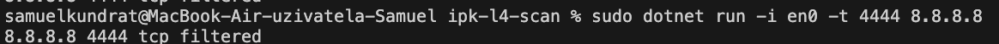

# IPK Project 1 - OMEGA: L4 Scanner

* **Author:** Samuel Kundrat (xkundrs00)  
* **OS:** macOS 15.3.2  
* **Language:** C#  
* **.NET version:** 8.0.407  
* **Used software:** Visual Studio Code, Wireshark, OpenVPN Connect, draw.io  
* **Assignment:** [Project 2 - OMEGA: L4 Scanner](https://git.fit.vutbr.cz/NESFIT/IPK-Projects/src/branch/master/Project_1/omega#project-2---omega-l4-scanner)  
## Content
- [Introduction](#introduction)
- [TCP and UDP Scanning Overview](#tcp-and-udp-scanning-overview)
  - [TCP Scan](#tcp-scan)
  - [UDP Scan](#udp-scan)
  - [Execution Flow Diagram](#execution-flow-diagram)
- [Testing](#testing)
  - [Testing Environment](#testing-environment)
  - [Testing Screenshots](#testing-screenshots)
  - [Testing Summary](#testing-summary)
- [Usage](#usage)
  - [Compilation](#compilation)
  - [Execution Examples](#execution-examples)
- [Output](#output)
- [Summary](#summary)
- [Bibliography](#bibliography)

---


## Introduction
My task was to develop an L4 scanner for **TCP** and **UDP** protocols. The primary function of this scanner is to analyze received packets (responses to my sent packets) if any are received. Based on the information extracted from these responses, the program determines and reports the status of the scanned ports.

### TCP and UDP Scanning Overview

A TCP and UDP port scanner is used to check the status of specific ports on a given device. By sending specially crafted packets, the scanner can determine if a port is **open, closed, or filtered**. Below is a brief explanation of how each type of scan works:

#### TCP Scan
- A **TCP SYN scan** sends only SYN packets to the target port, which initiates the process without completing the full handshake.  
- **Open port:** If the port is open, the target sends a SYN-ACK response, indicating that it is accepting connections.  
- **Closed port:** If the port is closed, the target responds with an RST packet.  
- **Filtered port:** If no response is received, the port is considered filtered, typically due to a firewall.  


#### UDP Scan
- UDP scanning works differently because UDP is connectionless, and there is no handshake.  
- **Closed port:** When a closed UDP port is scanned, the target responds with an ICMP "Destination Unreachable" message (port unreachable).  
- **Open port:** If the port is open, the target does not respond or may reply with an application-specific message.


#### Execution Flow Diagram
  
##### Legend:
* **Dark blue:** Starting function  
* **Green:** Pseudo-constructors  
* **Red:** Event handler  
* **Dark red:** End of scan  
* **Blue:** Functions that print output  

## Testing
All functionality testing was performed manually and locally. IPv6 testing was conducted using a VPN, as the campus network does not provide IPv6 connectivity. The correctness of each test was verified using Wireshark.

### Testing Environment
* macOS 15.3.2  

### Testing Screenshots
#### TCP Closed, UDP Open  
  
  

#### UDP Closed  
  
  

#### TCP Filtered  
  
  

### Testing Summary
The tests confirmed the correctness of the program's behavior in specific situations. During testing, I discovered some edge-case bugs, which were reviewed and subsequently fixed.

## Usage
The program must be executed with **root** privileges.

| Argument              | Possible Values | Description |
|-----------------------|----------------|-------------|
| `-h` / `--help`      | none           | Prints information about the program |
| `-i` / `--interface` | Interface name | Specifies the network interface name |
| `-t` / `--pt`        | 0 - 65535      | TCP port to scan |
| `-u` / `--pu`        | 0 - 65535      | UDP port to scan |
| `-w` / `--wait`      | > 0            | Maximum wait time for a response |
| `hostname`           | IPv4 / IPv6 / hostname | Destination address |

### Compilation
Compile the program using the following command: 

#### Makefile not working
If Makefile does not work, check Makefile for using tabulators not spaces
```
make
````
### Move to directory
```
cd ipk-l4-scan
````
### Execution Examples
```
./ipk-l4-scan --help
````
```
./ipk-l4-scan --interface
````
````
./ipk-l4-scan -i eth0 -w 1000 -t 80,443,8080 www.vutbr.cz
````

```
let message = 'Hello world';
alert(message);
```

## Output
```
IP PORT PROTOCOL PORT_STATUS
```
```
127.0.0.1 88 tcp open
```

## Summary
This project helped me find the good side of Networking which I hadn't seen until now. I learned a lot about __TCP__ and __UDP__ which I wouldn't have known until the exam if it hadn't been for this project. Testing taught me that I should test everything after small steps, start using my brain, and not do everything automatically.

## Bibliography
* Nmap: The Art of Port Scanning. Online. Available from: [https://nmap.org/nmap_doc.html#port_unreach](https://nmap.org/nmap_doc.html#port_unreach) [Accessed 17 February 2025].  
* TechTarget. (n.d.). *SYN scanning.* SearchNetworking. Retrieved March 26, 2025, from [https://www.techtarget.com/searchnetworking/definition/SYN-scanning](https://www.techtarget.com/searchnetworking/definition/SYN-scanning).  
* PELLETIER, Chris. *SharpPcap: A Packet Capture Framework for .NET* [online]. CodeProject, 2006. Available from: [https://www.codeproject.com/Articles/12458/SharpPcap-A-Packet-Capture-Framework-for-NET#filter](https://www.codeproject.com/Articles/12458/SharpPcap-A-Packet-Capture-Framework-for-NET#filter) [Accessed 26 March 2025].  
* Microsoft. *Microsoft .NET API Reference* [online]. Microsoft Learn. Available from: [https://learn.microsoft.com/en-us/dotnet/api/](https://learn.microsoft.com/en-us/dotnet/api/) [Accessed 26 March 2025].
* GeeksforGeeks. (n.d.). *What is UDP Scanning?* Retrieved March 27, 2025, from [https://www.geeksforgeeks.org/what-is-udp-scanning/](https://www.geeksforgeeks.org/what-is-udp-scanning/)


